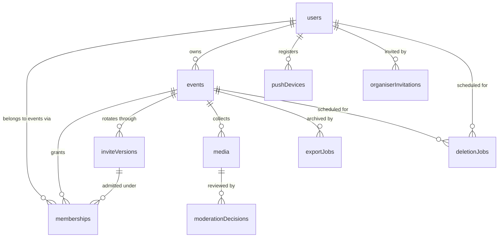
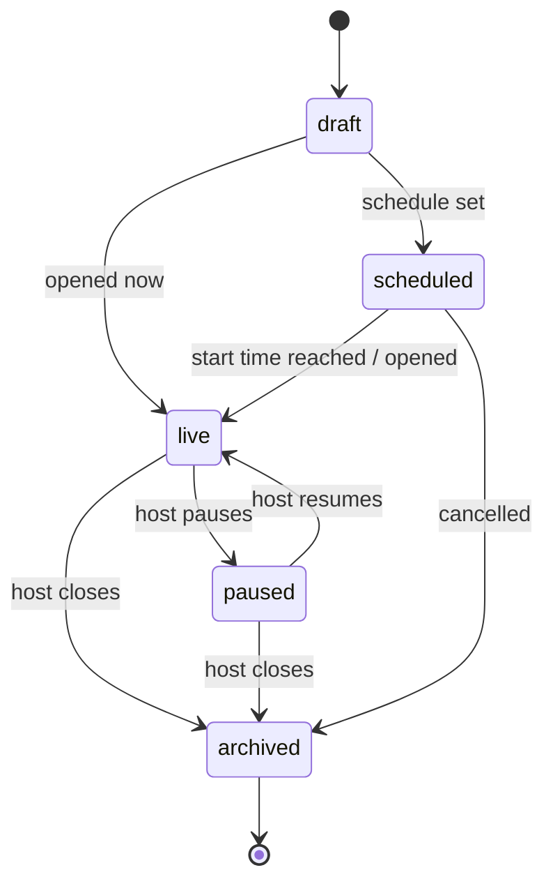
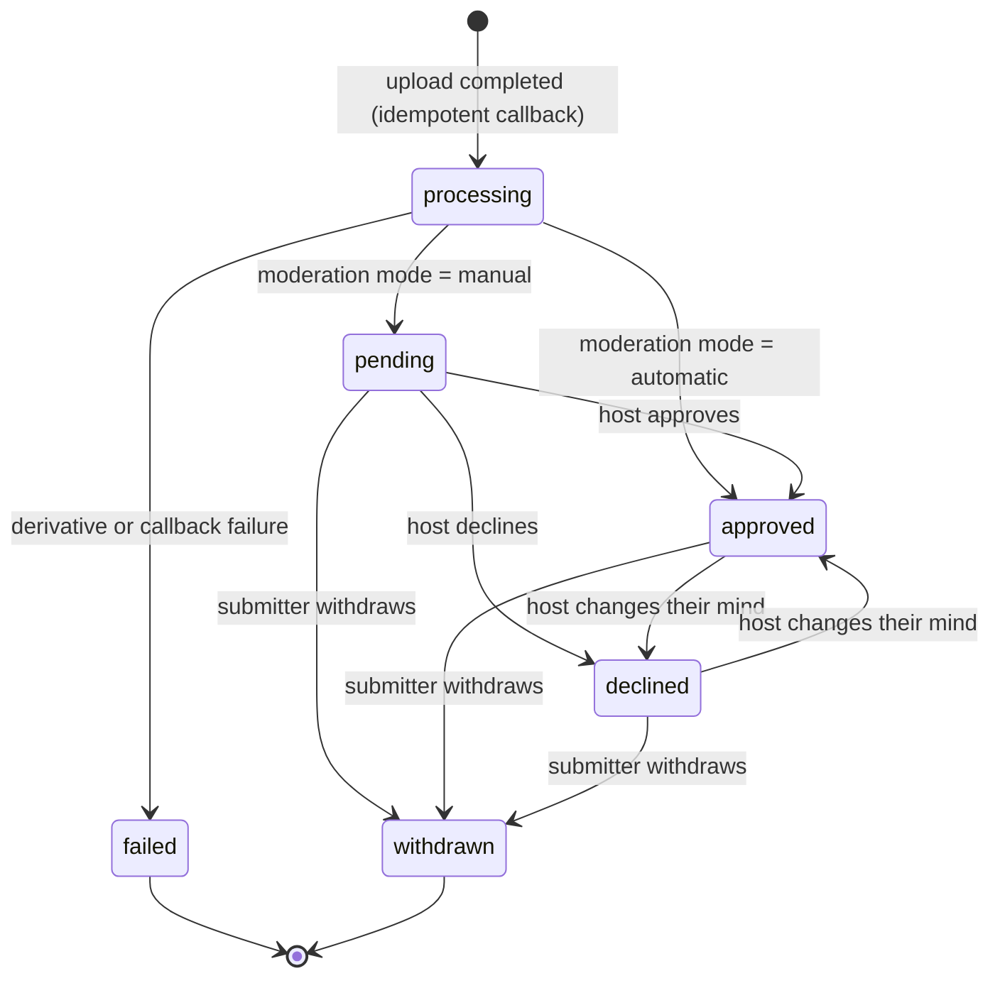
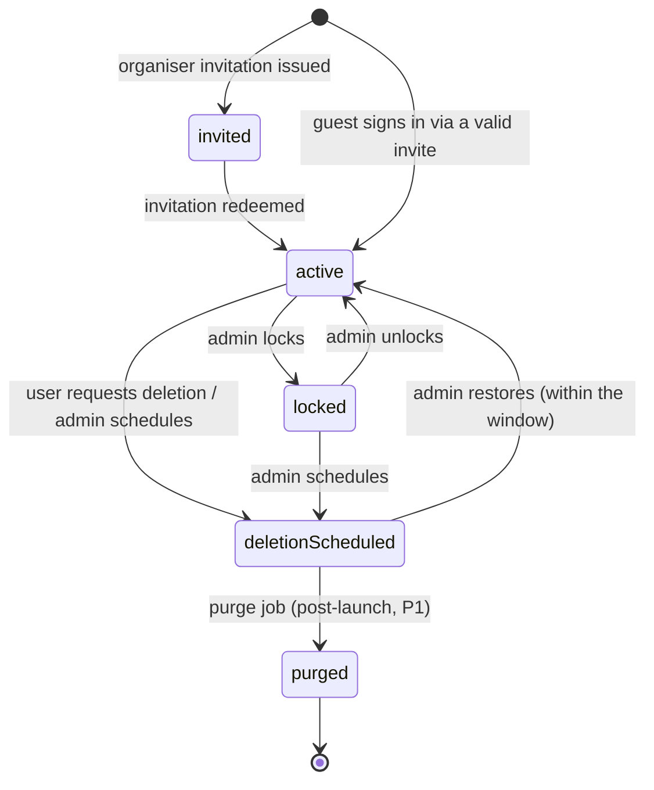
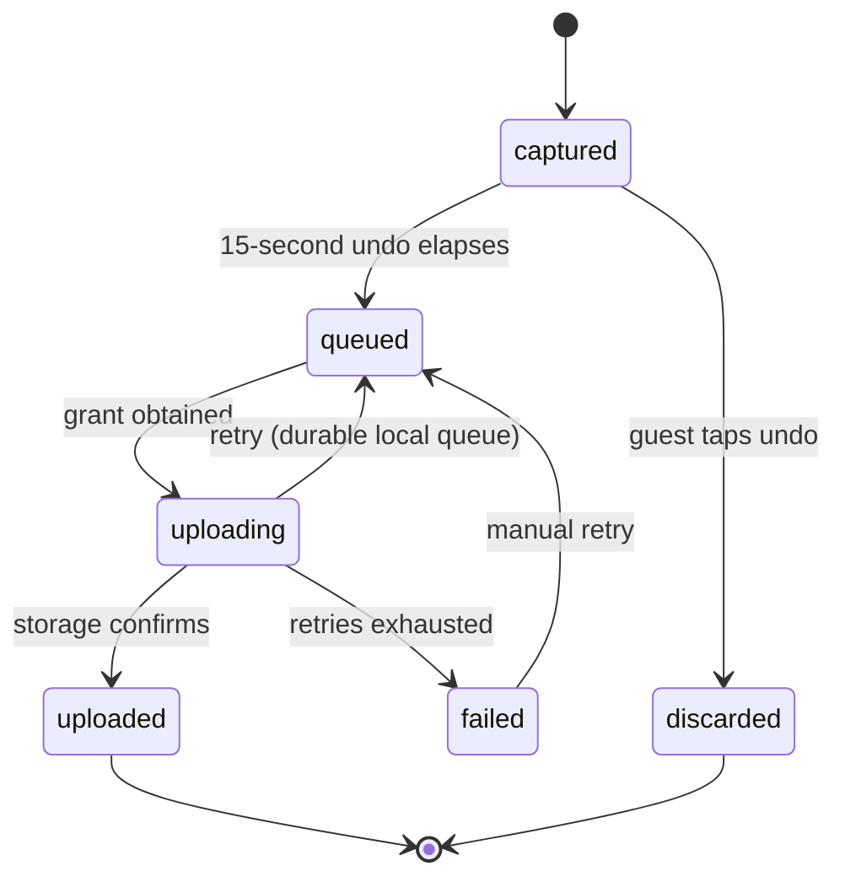

# Domain model

> Seeded from [`PLAN.md`](../PLAN.md) on 28 Jul 2026.
>
> **This document is indicative, not authoritative.** `packages/backend/convex/schema.ts` defines the
> real tables and `packages/contracts` defines the real validators and permission rules. Field lists
> here name the concepts and their relationships; they are not a column-by-column contract. When the
> two disagree, the code is right and this file is a bug — fix it in the same PR.

## Entities at a glance

`auditEvents` is deliberately absent from the diagram: it references everything and is written by
every privileged action.

| Entity                 | Holds                                                                                        | Notes                                                       |
| ---------------------- | -------------------------------------------------------------------------------------------- | ----------------------------------------------------------- |
| `users`                | identity, verified email, display name, avatar, account state                                | one row per human, shared across app and web                |
| `organiserInvitations` | email, token, issuing admin, expiry, redemption                                              | the only way into the private beta                          |
| `events`               | name, schedule + timezone, cover, accent, moderation mode, state, **`storageRegion`**        | see [ADR 0002](adr/0002-storage-region-adapter.md)          |
| `memberships`          | user ↔ event, role, admitting `inviteVersion`, state                                         | a guest's presence in one event                             |
| `inviteVersions`       | six-digit code, high-entropy QR token, version number, active flag                           | rotation creates a new version, never mutates the old       |
| `media`                | event, submitter, capture id, type, byte size, checksum, `storageRegion`, storage key, state | one row per submitted capture                               |
| `moderationDecisions`  | media, decider, decision, reason, timestamp                                                  | append-only; the media row carries the current state        |
| `exportJobs`           | event, requester, state, artefact key, expiry                                                | **post-launch (P2)** — table shape reserved                 |
| `pushDevices`          | user, Expo push token, platform, last seen                                                   | one row per installed app instance                          |
| `deletionJobs`         | subject (user or event), scheduled-at, state, requester                                      | states ship at launch, the purge worker is post-launch (P1) |
| `auditEvents`          | actor, action, subject, reason, before/after summary, timestamp                              | immutable; every admin and host action writes one           |

## Roles and permissions

Four roles: `globalAdmin`, and the three event roles `owner`, `cohost`, `guest`. `globalAdmin` is a
platform-level property of a user; the others are properties of a **membership**, so the same person
can be an owner of one event and a guest in another.

Legend: ✅ allowed · ❌ denied · — not applicable.

| Capability                          | `guest` | `cohost` | `owner` | `globalAdmin` |
| ----------------------------------- | :-----: | :------: | :-----: | :-----------: |
| Join with a valid, current invite   |   ✅    |    ✅    |   ✅    |       —       |
| Capture and upload to the event     |   ✅    |    ✅    |   ✅    |      ❌       |
| See own media and its status        |   ✅    |    ✅    |   ✅    |      ❌       |
| Withdraw own media                  |   ✅    |    ✅    |   ✅    |      ❌       |
| View the approved gallery           |   ✅    |    ✅    |   ✅    |      ❌       |
| Approve / decline any media         |   ❌    |    ✅    |   ✅    |      ❌       |
| Run the slideshow                   |   ❌    |    ✅    |   ✅    |      ❌       |
| Rotate the invite (code + QR token) |   ❌    |    ✅    |   ✅    |      ✅       |
| Revoke a membership                 |   ❌    |    ✅    |   ✅    |      ✅       |
| Invite a co-host                    |   ❌    |    ❌    |   ✅    |      ❌       |
| Edit event settings                 |   ❌    | partial  |   ✅    |      ❌       |
| Delete or transfer the event        |   ❌    |    ❌    |   ✅    |   schedule    |
| Invite an organiser into the beta   |   ❌    |    ❌    |   ❌    |      ✅       |
| Lock / unlock an account            |   ❌    |    ❌    |   ❌    |      ✅       |
| Schedule / restore deletion         |   ❌    |    ❌    |   own   |      ✅       |
| Read any media bytes                |   ❌    |    ❌    |   ❌    |    **❌**     |
| Impersonate a user                  |   ❌    |    ❌    |   ❌    |    **❌**     |

Two invariants worth stating loudly, because they are easy to erode:

1. **A co-host is never an owner.** No delete, no transfer, no change of ownership. Ever.
2. **A global admin never sees media and never impersonates.** Admin power is over accounts, events
   and codes — not over content.

Everything above must be expressed as testable functions in `packages/contracts`, not as scattered
`if` statements in UI code. Sprint 2 owns those unit tests.

## State machines

### Event

Joins and uploads are accepted in `live` only. `paused` keeps the gallery and slideshow readable but
refuses new captures — it is the "we are done for now" pressure valve. `archived` is read-only.

### Media

Only `approved` media is visible in the gallery and the slideshow. `withdrawn` is terminal from the
submitter's side and removes the item from every surface. The `ai` moderation mode adds an
auto-approve path into `approved` post-launch; it never auto-declines.

Because upload callbacks can arrive out of order, the transition into `processing` and out of it
must be **idempotent and reconciling** — a late callback for an already-approved item is a no-op,
not a regression. Sprint 3 owns those unit tests.

### Account

`deletionScheduled` **revokes access immediately** — it is not a soft warning state. Apple requires
in-app account deletion, and this is what that button does at launch. The 30-day hard purge lands
post-launch; until then the final step is operated by script.

`locked` suspends owner and co-host access, joins, uploads and slideshows across every event the
account owns. That blast radius is the point: it is the party-night emergency stop.

### Capture, client side

This machine lives on the device, not in Convex. `uploaded` is where the server-side **Media**
machine picks up. The queue is durable and resumes in the foreground; background retry is
best-effort and post-launch.

## Invitations and joining

An event has exactly one **active invite version** at a time. Each version carries a **six-digit
join code**, unique among joinable events, and a **high-entropy QR token** used in the universal
link. Rotation mints a new version and deactivates the old one; the host chooses whether existing
memberships are **kept or revoked**. A join attempt against a superseded version is rejected.

Joining is authenticated, rate-limited, enumeration-protected and audited. Enumeration protection
matters more than it looks: a six-digit code is only a million values, so failed-join responses must
not distinguish "no such event" from "wrong version" from "event not live".

## `storageRegion`

`events.storageRegion` is a string enum, currently `["pdx1"]`. It is set at event creation and
becomes **immutable once the first upload lands**. Upload grants carry it, media rows record it, and
a storage adapter resolves credentials and host from it. Files never migrate when the value changes.

The full reasoning, alternatives and the multi-region path are in
[ADR 0002](adr/0002-storage-region-adapter.md).

## Not yet written

Filled in by the sprint that builds the thing, rather than guessed now:

- **(Sprint 2)** Concrete permission-function names and their test matrix.
- **(Sprint 3)** The upload-grant record: exact fields, expiry, single-use enforcement, and the
  reconciliation rules for out-of-order completion callbacks.
- **(Sprint 4)** Report and block entities required for App Review.
- **(Sprint 5)** The audit-event taxonomy — the closed list of `action` values.
