# Domain model

> Seeded from [`PLAN.md`](../PLAN.md) on 28 Jul 2026.
>
> **This document is indicative, not authoritative.** `packages/backend/convex/schema.ts` defines the
> real tables and `packages/contracts` defines the real validators and permission rules. Field lists
> here name the concepts and their relationships; they are not a column-by-column contract. When the
> two disagree, the code is right and this file is a bug — fix it in the same PR.

## Entities at a glance

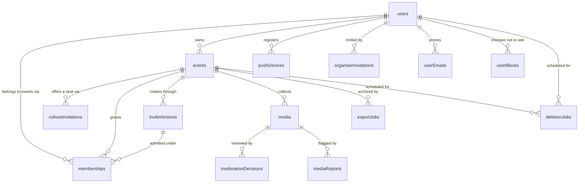

`auditEvents` is deliberately absent from the diagram: it references everything and is written by
every privileged action.

| Entity                      | Holds                                                                                                                                   | Notes                                                                        |
| --------------------------- | --------------------------------------------------------------------------------------------------------------------------------------- | ---------------------------------------------------------------------------- |
| `users`                     | identity, verified email, display name, avatar, `onboardedAt`, account state                                                            | one row per human, shared across app and web                                 |
| `organiserInvitations`      | email, token, issuing admin, expiry, redemption                                                                                         | the only way into the private beta                                           |
| `cohostInvitations`         | event, email, inviting host, expiry, redemption                                                                                         | a co-host seat offered to an address with no account yet                     |
| `userEmails`                | user, address, status, hashed verification code, attempts                                                                               | a second address proven by OTP (Apple private relay)                         |
| `joinAttempts`              | throttle key, failure count, window, lockout                                                                                            | holds no code and no event id — counters only                                |
| `events`                    | name, schedule + timezone, cover, accent, moderation mode, state, **`storageRegion`**                                                   | see [ADR 0002](adr/0002-storage-region-adapter.md)                           |
| `memberships`               | user ↔ event, role, admitting `inviteVersion`, state                                                                                    | a guest's presence in one event                                              |
| `inviteVersions`            | six-digit code, high-entropy QR token, version number, active flag                                                                      | rotation creates a new version, never mutates the old                        |
| `media`                     | event, submitter, capture id, type, byte size, checksum, `storageRegion`, optional challenge snapshot, storage + derivative keys, state | one row per submitted capture, **however many objects it is made of**        |
| `photoChallenges`           | event, editable prompt, normalized duplicate key, active/archive state, source                                                          | 3–50 active prompts while enabled                                            |
| `photoChallengeAssignments` | event, user, challenge, immutable prompt snapshot, cycle, status, optional capture id                                                   | one row per issued prompt                                                    |
| `photoChallengeProgress`    | event, user, current assignment, cycle, seen challenge ids                                                                              | one bounded row per event/account                                            |
| `moderationDecisions`       | media, decider, decision, reason, timestamp                                                                                             | append-only; the media row carries the current state                         |
| `mediaReports`              | media, reporter, reason, free-text detail, open/actioned/dismissed                                                                      | a complaint, not a decision — see [ADR 0005](adr/0005-moderation-model.md)   |
| `userBlocks`                | blocker, blocked, where it was made                                                                                                     | per-account and global; a filter on the blocker's own reads                  |
| `exportJobs`                | event, requester, state, artefact key, expiry                                                                                           | **post-launch (P2)** — table shape reserved                                  |
| `pushDevices`               | user, Expo push token, platform, failure count, disabled-at + reason, last seen                                                         | one row per **installation** — a token is a phone, not a person              |
| `pushNotifications`         | user, device, category, title/body, delivery state, Expo ticket id, receipt outcome                                                     | a mutation cannot `fetch`, so the decision and the send are two transactions |
| `notificationThrottles`     | namespaced key, last-sent-at, category memory                                                                                           | the debounce that makes a burst one ping                                     |
| `rotationAttempts`          | event key, count, window                                                                                                                | five rotations an hour per event; counts successes                           |
| `deletionJobs`              | subject (user or event), scheduled-at, state, requester                                                                                 | states ship at launch, the purge worker is post-launch (P1)                  |
| `auditEvents`               | actor, action, subject, reason, before/after summary, timestamp                                                                         | immutable; every admin and host action writes one                            |

## Roles and permissions

Four roles: `globalAdmin`, and the three event roles `owner`, `cohost`, `guest`. `globalAdmin` is a
platform-level property of a user; the others are properties of a **membership**, so the same person
can be an owner of one event and a guest in another.

Legend: ✅ allowed · ❌ denied · — not applicable.

| Capability                          | `guest` | `cohost` | `owner` | `globalAdmin` |
| ----------------------------------- | :-----: | :------: | :-----: | :-----------: |
| Join with a valid, current invite   |   ✅    |    ✅    |   ✅    |       —       |
| Capture and upload to the event     |   ✅    |    ✅    |   ✅    |      ❌       |
| See own media and its status        |   ✅    |    ✅    |   ✅    |      ❌       |
| Withdraw own media                  |   ✅    |    ✅    |   ✅    |      ❌       |
| View the approved gallery           |   ✅    |    ✅    |   ✅    |      ❌       |
| Approve / decline any media         |   ❌    |    ✅    |   ✅    |      ❌       |
| Run the slideshow                   |   ❌    |    ✅    |   ✅    |      ❌       |
| Rotate the invite (code + QR token) |   ❌    |    ✅    |   ✅    |      ✅       |
| Revoke a **guest's** membership     |   ❌    |    ✅    |   ✅    |      ✅       |
| Revoke a **co-host's** membership   |   ❌    |    ❌    |   ✅    |      ✅       |
| Invite or un-invite a co-host       |   ❌    |    ❌    |   ✅    |      ❌       |
| Edit event settings + moderation    |   ❌    |    ✅    |   ✅    |      ❌       |
| Move between `live` and `paused`    |   ❌    |    ✅    |   ✅    |      ✅       |
| Archive (end) the event             |   ❌    |    ❌    |   ✅    |      ✅       |
| Delete or transfer the event        |   ❌    |    ❌    |   ✅    |   schedule    |
| Invite an organiser into the beta   |   ❌    |    ❌    |   ❌    |      ✅       |
| Lock / unlock an account            |   ❌    |    ❌    |   ❌    |      ✅       |
| Schedule / restore deletion         |   ❌    |    ❌    |   own   |      ✅       |
| Read any media bytes                |   ❌    |    ❌    |   ❌    |    **❌**     |
| Impersonate a user                  |   ❌    |    ❌    |   ❌    |    **❌**     |

Three invariants worth stating loudly, because they are easy to erode:

1. **A co-host is never an owner.** No delete, no transfer, no archive, and no changing who else is
   a host — a co-host cannot invite one, withdraw an invitation to one, or revoke one. Ever.

   Sprint 5 _widened_ the co-host set in one place and narrowed it in another, both deliberately.
   Settings and moderation-mode editing moved **in**, because PLAN.md's mitigation for solo
   moderation (risk #4) is "co-hosts and `automatic` mode as a pressure valve" and a co-host who
   cannot reach the switch is not a pressure valve. Revoking another co-host moved **out**, because
   two co-hosts who can each remove the other is a race, not a permission.

2. **A global admin never sees media and never impersonates.** Admin power is over accounts, events
   and codes — not over content. Since Sprint 5 this is enforced in four independent places:
   `CAPABILITIES` grants the role no `media.*` action, `canSeeMedia` refuses it every row,
   `stats.overview` withholds the per-guest breakdown, and `projectMedia` mints no signed URL for
   the role even if a read path were reached.

3. **A lock freezes the party, not just the person.** A locked (or deletion-scheduled) **owner**
   suspends every event they own for everybody — co-host access, joining, upload grants, slideshow
   and signed-URL issuance alike. See [The account-lock sweep](#the-account-lock-sweep).

Everything above is expressed as testable functions in
[`packages/contracts/src/permissions.ts`](../packages/contracts/src/permissions.ts), not as scattered
`if` statements in UI code:

- `hasCapability(role, action)` — does this role ever get this action?
- `can(role, action, resource)` — …and does the resource's state and ownership allow it now?
- `canAct(actor, action, resource)` / `explainCan(…)` — …and is the actor's **account** active enough?

`permissions.test.ts` holds a `Record<Action, readonly Role[]>` covering every action × role pair, so
adding an action is a compile error until the table is updated. The backend never re-derives a rule:
`requirePermission` in `packages/backend/convex/lib/guards.ts` only turns a `false` into the right
`ConvexError`.

## State machines

### Event

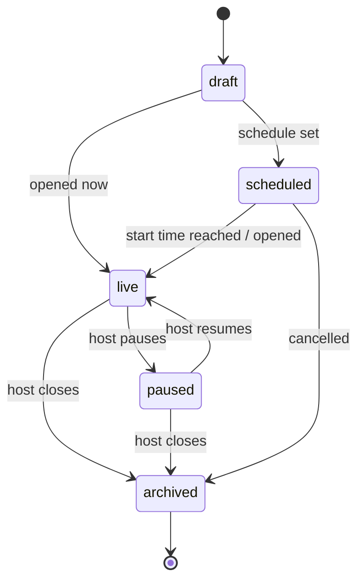

Uploads are accepted in `live` only. **Joins are accepted in `scheduled`, `live` and `paused`** — a
QR printed a week early has to work when the guest scans it in the hallway, and pausing is a pressure
valve on uploads, not a locked front door (`JOINABLE_EVENT_STATES` in
[`contracts/src/events.ts`](../packages/contracts/src/events.ts)). `paused` keeps the gallery and
slideshow readable but refuses new captures. `archived` is read-only.

Hosts may set every state except `deletionScheduled` (`HOST_SETTABLE_EVENT_STATES`). That one is
reserved for the deletion flow, because reaching it must also write the `deletionJobs` row that makes
the 30-day restore window real.

### Media

A photo may carry a challenge prompt snapshot. The upload accepts only a server-issued assignment
already resolved as `used` for the same event, account and `captureId`; the client never supplies
the caption. Challenges apply only to original photos whose media source is `capture`. Host edits
change future assignments and never rewrite snapshots already issued or attached.

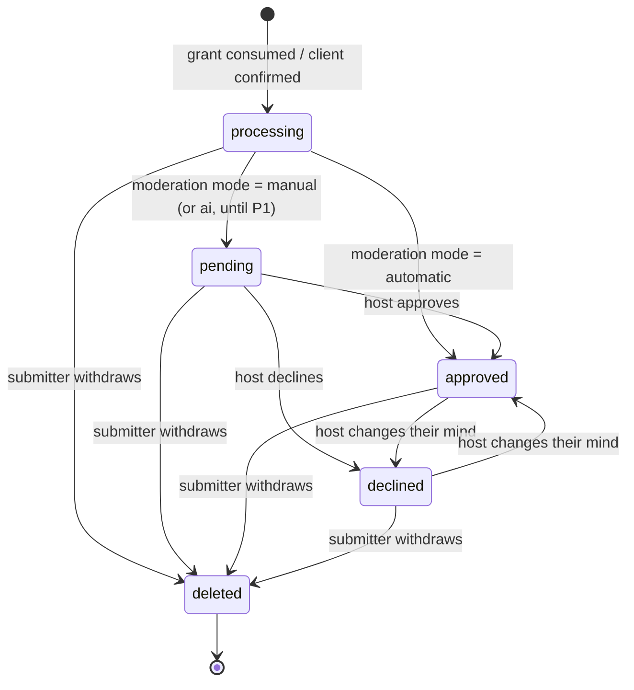

The terminal state is `deleted`, not `withdrawn` — one state covers a guest taking their photo back
and a host removing it, because from every read path's point of view the two are the same fact and a
second name for it is a second thing to remember to filter on. `media.withdrawnAt` records _which_
of the two it was. There is no `failed` state either: an upload that never completes leaves a
`processing` row with no storage key, which is the same shape a retry can pick up, and the grant that
would have completed it simply expires.

Who sees what is [`canSeeMedia`](../packages/contracts/src/media.ts), and it is the read-path half of
the privacy invariant in `PLAN.md`:

| Role          | Others' media             | Own media                 |
| ------------- | ------------------------- | ------------------------- |
| `guest`       | `approved` only           | every state but `deleted` |
| `cohost`      | every state but `deleted` | every state but `deleted` |
| `owner`       | every state but `deleted` | every state but `deleted` |
| `globalAdmin` | **nothing**               | **nothing**               |

Because the two completion signals can arrive in either order and more than once, the transition
into `processing` and out of it is **idempotent and reconciling**, keyed on `(eventId, captureId)`:
a late callback for an already-settled item is a no-op, and one for a withdrawn item deletes its own
bytes rather than reviving the row. [ADR 0004](adr/0004-private-upload-pipeline.md) has the full
argument; `packages/backend/convex/media.test.ts` has the tests.

### Account

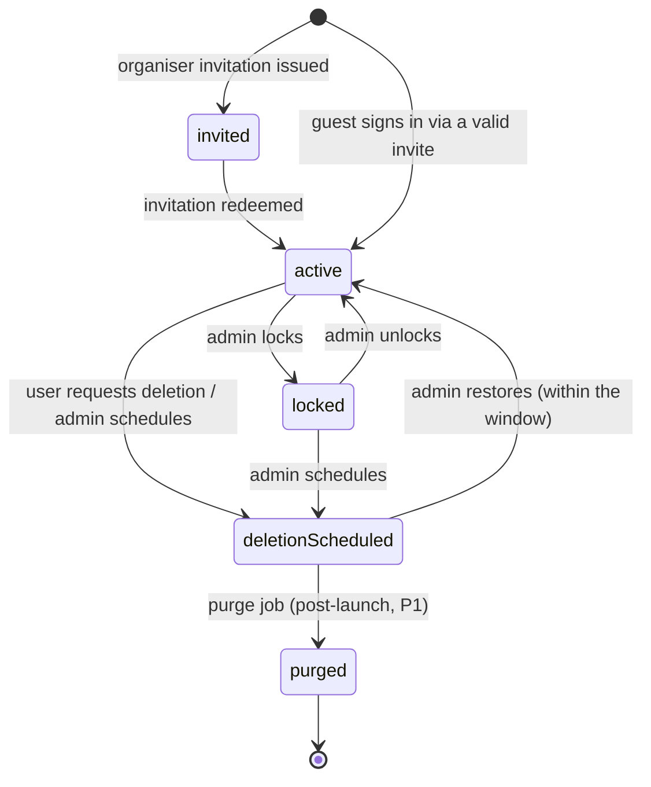

`deletionScheduled` **revokes access immediately** — it is not a soft warning state. Apple requires
in-app account deletion, and this is what that button does at launch. The 30-day hard purge lands
post-launch; until then the final step is operated by script.

`locked` suspends owner and co-host access, joins, uploads and slideshows across every event the
account owns. That blast radius is the point: it is the party-night emergency stop.

### Invite version

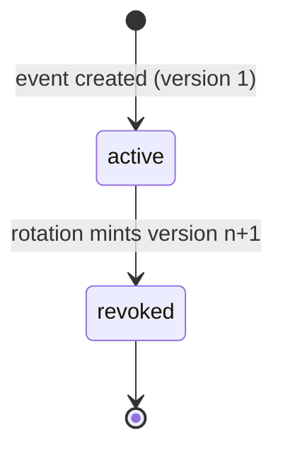

Two rules make this smaller than it looks:

- **A version is never mutated.** Rotation inserts a new row and marks the old one `revoked`; the
  old code and token stay on the old row. That is what lets "how did this person get in last week?"
  stay answerable after three rotations.
- **Exactly one version is `active` per event.** Everything a guest can present resolves to a
  version, and only the active one admits.

Rotation carries a `keepExistingMemberships` choice. `true` keeps everyone and only kills the old
credential; `false` additionally revokes **guest** memberships — hosts always keep theirs, because
locking a co-host out mid-party helps nobody. Memberships record the version that admitted them, so
a revoked-version join is refusable without a second table.

### Membership

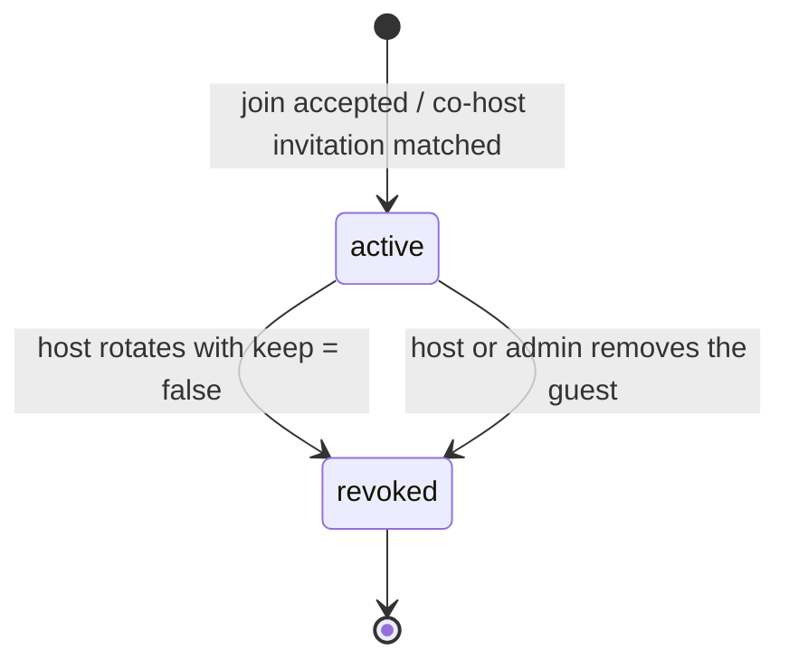

`revoked` is terminal, and that is the transition worth stating plainly _because_ it is missing: a
revoked membership is **not** re-activated by presenting a current code. A host who removed someone meant it, and a fresh QR must
not undo that. The join returns the same single rejection sentence as every other refusal, so the
person cannot tell "removed" from "wrong code".

### Capture, client side

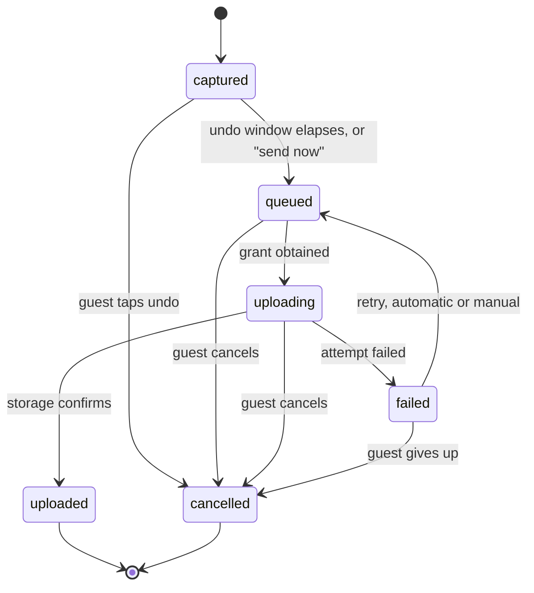

This machine lives on the device, not in Convex — `CAPTURE_STATES` and `captureStateMachine` in
[`packages/contracts/src/media.ts`](../packages/contracts/src/media.ts). The terminal state is
**`cancelled`**, not `discarded`, and a failed attempt goes back through `queued` rather than
straight to `uploading`: `TERMINAL_CAPTURE_STATES` is derived from the transition table itself, so
both clients agree by construction rather than by two lists staying in step.

`uploaded` is where the server-side **Media** machine picks up. Both clients drive the same
vocabulary — `apps/web`'s `uploadReducer` and `apps/mobile`'s `queueReducer` — but only the app's
queue is **durable**: it persists to the document directory, rewrites anything left `uploading` back
to `queued` on cold start and on foreground, and retries on a backoff ladder. Mobile web keeps its
queue in memory and offers a retry button, because a browser tab that is closed has no queue to
resume. Background retry (uploading while the app is off screen) is best-effort and post-launch.

## Invitations and joining

An event has exactly one **active invite version** at a time. Each version carries a **six-digit
join code**, unique among joinable events, and a **high-entropy QR token** (160 bits, Crockford
base32) used in the universal link. Rotation mints a new version and deactivates the old one; the
host chooses whether existing memberships are **kept or revoked** — hosts always keep theirs. A join
attempt against a superseded version is rejected.

"Unique among joinable events" is doing real work. Archiving an event frees its code **implicitly**:
nothing is rewritten, the old row keeps the code, and the code stops counting because its event is no
longer joinable. So a lookup by code can match several rows and must filter rather than assume one —
and re-opening an archived event has to re-check its code, **minting a new invite version** if
somebody else has since been given that number. Not editing the old row: an `inviteVersions` row is
the historical credential every membership admitted under it points at, so rewriting its code would
make the log claim guests joined with digits that did not exist yet.

The same immutability rule is why a rotation must always _change_ the code. The collision check
excuses the event's own outgoing version — otherwise no rotation could run — and that exemption used
to let a random draw, or an admin picking a specific value, hand back the six digits the rotation was
supposed to kill.

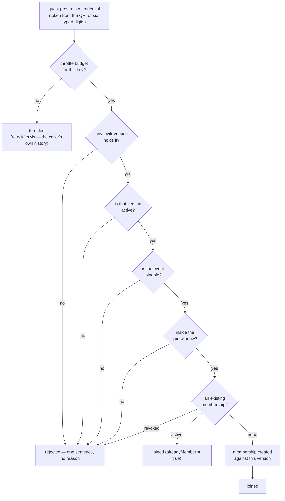

Every path into `rejected` returns the **same value**: one fixed message and no other field. The
five reasons are named in `JOIN_REJECTION_REASONS` and go to `auditEvents` only. `throttled` is the
one failure that is safe to be specific about, because it depends solely on the caller's own attempt
history, which is not information they lack.

Joining is authenticated, rate-limited, enumeration-protected and audited:

- **Authenticated** — there is always a user, which is what gives the throttle a key.
- **Rate-limited** — `joinAttempts` counts failures per key (`user:<id>`, plus `net:<hash>` for calls
  that came through `apps/web`'s `POST /api/join`, which derives it from the forwarded address).
  Ten failures in fifteen minutes starts a fifteen-minute lockout, and **only elapsed time hands the
  budget back**. A success used to reset it, which was a complete bypass: an admitted attempt is not
  scarce — replaying your own party's code counts — so "nine guesses, one replay" looped forever.
  The read-decide-write happens inside a Convex mutation, so it is transactional.
  The Expo app has no server in front of it and is charged on the account key alone; a client-supplied
  network key is treated as untrusted, because it can only ever add a key, never remove one.
- **Enumeration-protected** — a six-digit code is only a million values, so every failure returns the
  same value: one fixed sentence, no other fields. "No such code", "superseded version", "not
  joinable yet", "outside the schedule window" and "your membership was revoked" are
  indistinguishable from outside. The real reason goes to `auditEvents` and nowhere else.
- **Audited** — every attempt writes a row: `membership.join_succeeded` for every admitted one
  (including repeat scans that change nothing — a replayed credential must not be invisible),
  `membership.created` only when a row actually appears, and `membership.join_rejected` for every
  refusal, throttles included.

The pre-join preview follows the same logic, which is why it is split in two: previewing from a
**token** is a query (160 bits is not enumerable, and the join page must render before sign-in),
while previewing from a typed **code** is a _mutation_, because only a mutation can spend a throttle
budget. Both run the same credential evaluation as a join, and the code preview is audited on the
same terms — it is the endpoint a code-walker actually calls, so a silent refusal there would blind
the log exactly at the ceiling.

### Verified-email matching

On authentication — and on demand via `users.refreshRoles` — every address the user has **proven**
is matched against pending `organiserInvitations` and `cohostInvitations`. A match accepts the
invitation and grants the role: organiser (unlocking event creation) or a `cohost` membership.

Only verified addresses count. An address is verified when the provider vouched for it
(`users.emailVerified`) or its owner proved it with a six-digit code (`userEmails`). Anything looser
would mean typing someone else's address into a sign-up form inherits their co-host seat.

Apple private-relay users are the reason `userEmails` exists: an invitation cannot reach
`@privaterelay.appleid.com`, so they add a real address and prove it through the same OTP
infrastructure — same ten-minute expiry, same five-guess budget, same per-address send ceiling, code
stored hashed.

### Co-host invitations

An invitation is addressed to an **email**, not to a person, because the whole point is that the
person may not have an account yet — `memberships.userId` is required and cannot express "somebody,
eventually". `cohostInvitations` holds the promise; verified-email matching turns it into a `cohost`
membership the moment its owner appears with a proven address.

| Step                    | What happens                                                                                                                           |
| ----------------------- | -------------------------------------------------------------------------------------------------------------------------------------- |
| Owner invites           | `cohosts.invite` (an **action**, because it emails) → `pending` row with a token and a 14-day expiry, plus `membership.cohost_invited` |
| Re-invite               | The same row's expiry is refreshed and the **token is kept**, so a link already in an inbox stays live                                 |
| Acceptance              | A verified address matching `email` → membership upgraded to `cohost`, `membership.cohost_invite_accepted`                             |
| Owner withdraws         | `cohosts.revokeInvitation` → `revoked`, **token burned**, `membership.cohost_invite_revoked`                                           |
| Owner removes a co-host | `cohosts.remove` → membership revoked **and** any pending invitation to the same address revoked with it                               |

Two properties are worth being explicit about:

- **The token in the email is not a credential.** It addresses the invitation so the link lands on
  the right party with the right explanation; it grants nothing. Acceptance binds on a _verified_
  address match, so a forwarded email hands on a URL and no seat. This is deliberately different
  from the organiser invitation, which _is_ claimed by token — a co-host seat carries the ability to
  see every guest's photographs, including the pending ones, and a capability like that must not be
  transferable by forwarding a message.
- **Removing a co-host takes the invitation with it.** Otherwise the next sign-in finds the pending
  row, matching revives the membership (which is correct behaviour for a _re_-invited host), and the
  removal quietly undoes itself.

### Invite rotation: keep or revoke

Rotation always replaces **both** credentials and never edits the outgoing row — "which QR was on
the wall in July" stays answerable. What the host chooses is what happens to the people:

| `keepExistingMemberships` | Guests                                                                              | Hosts |
| ------------------------- | ----------------------------------------------------------------------------------- | ----- |
| `true` (default)          | keep their seats; re-scanning moves them onto the new version                       | keep  |
| `false`                   | revoked, one `membership.revoked` audit row each, outstanding upload grants expired | keep  |

Hosts always keep their seats: rotation is aimed at the guest list, and locking the co-host out of
the console mid-party helps nobody.

A revoked guest loses access **reactively** — the next re-run of any subscription resolves no role
and the event answers `notFound` — and can come back only through the **new** code. That last part
needs a distinction the row did not previously carry: `memberships.revokedByRotation` marks a _sweep_
as opposed to a host's deliberate _removal_. A removal survives a fresh scan of a valid QR, because
it is a judgement about that person; a sweep does not, because it is a judgement about the
credential and everybody who comes back is holding the replacement.

Because the choice is irreversible and is offered on **two** surfaces — the organiser console's
modal and the app's Host tab — the sentences describing each option are themselves a contract:
`ROTATION_CONSEQUENCES` in `@partybooth/contracts/codes`, next to the budget that enforces it, with
`keepExistingMemberships(choice)` as the only place the choice becomes a boolean. The two clients had
already drifted into describing the same sweep differently, which is the worst available outcome: a
host who read "co-hosts are kept" on a laptop and "every guest is removed" on a phone has to guess
which is current. The console additionally opens with **no** option selected — the API's `true`
default is right for a call and wrong for a dialog — while the app defaults to the non-destructive
`keep` and requires a deliberate switch for the sweep.

Rotation is budgeted at **five an hour per event** (`ROTATION_POLICY`, `rotationAttempts`). The
ceiling exists because the revoke path writes one audit row per guest it removes, so a held-down
button turns one fifty-guest party into an unbounded pile of writes during the evening it is meant
to protect. The budget counts successes, like the upload one and unlike the join one.

### The account-lock sweep

PLAN.md: a lock "suspends owner/co-host access, joins, uploads and slideshows **across owned
events**". That is two halves, and only the first was ever enforced by the account-state gate.

- **The actor's own state** — `accountStateAllows` reduces a locked account to "view yourself" and
  "delete yourself" (App Review requires in-app deletion to stay reachable, and a lock nobody can
  appeal or escape is a trap rather than a suspension).
- **The event's owner's state** — an event whose owner is locked, deletion-scheduled or deleted is
  **frozen for everybody**. `lib/lock.ts` computes it and `requireEventActor` asserts it, which is
  the single function every event-scoped read and write in the product passes through; `join.ts`
  asserts it separately, because joining is the one path that reaches an event without a membership.

Deriving the freeze from the event's owner, rather than sweeping a list of events at lock time, is
what makes it total: there is no event — existing, or created a second before the lock — that the
enumeration could miss, and no sixteenth surface added in a later sprint that has to remember.

A global admin passes through the freeze, because the console has to be able to look at the party it
just froze and at the account it is about to unlock. Guests are told one vague sentence: whose
account is suspended and why is not a fact to broadcast to thirty people at a door.

### Push notifications

Three categories, which are the units of opt-out because they are the units of "turn this off":
`uploadStatus` (your own upload failed, and later that it recovered), `eventLifecycle` (a party you
are in opened or closed) and `hostPendingThreshold` (you are hosting and the queue has built up).
Preferences are stored as an **opt-out list** plus a per-user threshold (`users.notificationOptOut`,
`users.pendingNotifyThreshold`), so adding a category defaults to _on_ without a migration.

The shape is a queue rather than a function call for one reason: **a Convex mutation has no
`fetch`**. Deciding to notify somebody happens inside the mutation that caused it, so it must be a
database write; the send must be an action; and `pushNotifications` is what survives the gap.

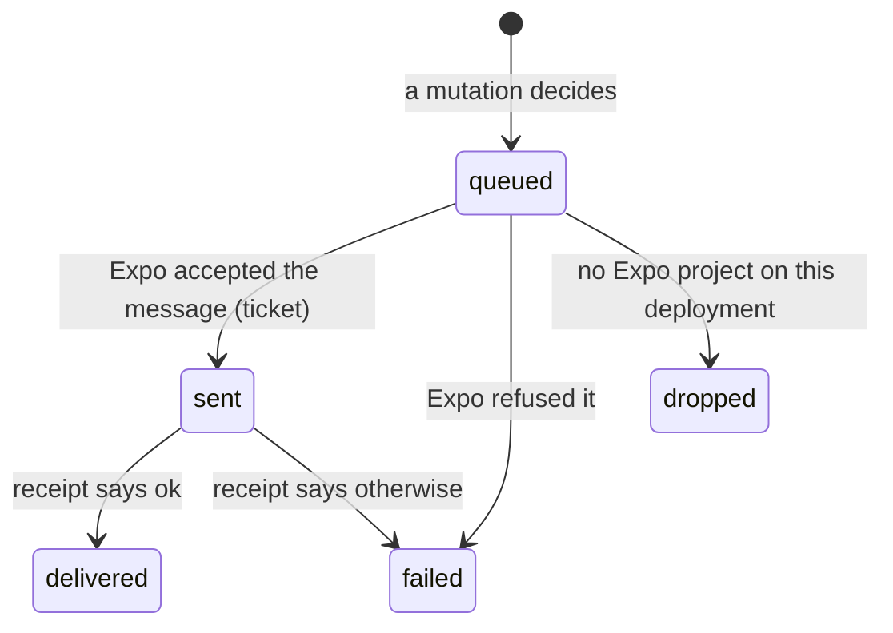

- **Debounced** by `notificationThrottles`, keyed per `(category, subject, user)`. Thirty photos
  landing in one minute cross the host's threshold once and buzz once; dropping back under the
  threshold **clears** the memory, so the next rush pings immediately rather than waiting out a
  window that started during the last one.
- **Chunked** at Expo's documented ceiling of 100 messages per send and 1000 ids per receipt
  request, and **receipt-checked** about fifteen minutes later — which is where
  `DeviceNotRegistered` almost always arrives, and therefore where token pruning actually happens.
- **A token is a phone, not a person.** Registering a token already held by another account
  _reassigns_ it, because the alternative is the previous account's notifications arriving in
  somebody else's hands.
- **Only `DeviceNotRegistered` prunes.** `MessageTooBig`, `MessageRateExceeded`, `MismatchSenderId`,
  `InvalidCredentials` and `InvalidProviderToken` describe the message or the project's credentials,
  and pruning on those would empty the table the day somebody rotates an APNs key. The three
  credential errors are also exempt from the **failure counter** — otherwise a revoked key, which
  fails for every device at once, disables the whole table on the third send instead of immediately,
  which is the same disaster arrived at slowly.
- **The routing payload is a contract, not a convention.** The `data` bag a notification carries is
  built by `@partybooth/contracts/push`'s `uploadStatusPayload` / `eventLifecyclePayload` /
  `pendingThresholdPayload` and read back by its `parsePushPayload`. It crosses a network and a JSON
  round trip between two codebases, so neither the backend nor the app spells one of its keys, and a
  builder→parser round-trip test is what keeps the tap table honest. `kind` **is** the category: the
  thing a person opted out of and the thing a tap opens are the same thing.

Everything is behind `PushAdapter` (`lib/push/`), so the whole stack is unit-tested offline against
a fake. A deployment with no `EAS_PROJECT_ID` resolves the unconfigured adapter and marks its
notifications `dropped`: a party where nobody's phone buzzes is a party, and one where approving a
photo throws because push is unset is not.

### Admin operations

The `/admin` console is a **separate shell** behind OTP plus `ADMIN_EMAIL_ALLOWLIST`, and every
function it calls re-checks `requireGlobalAdmin` server-side — the layout gate in `apps/web` is
defence in depth, not the boundary.

| Operation                                       | Subject | Reversible?                                    |
| ----------------------------------------------- | ------- | ---------------------------------------------- |
| `inviteOrganiser`                               | account | the invitation expires or is left unredeemed   |
| `lockAccount` / `unlockAccount`                 | account | yes — and the freeze lifts with the unlock     |
| `scheduleAccountDeletionFor` / `restoreAccount` | account | yes, inside the 30-day window                  |
| `scheduleEventDeletion` / `restoreEvent`        | event   | yes, inside the 30-day window                  |
| `rotateEventCode`                               | event   | no — the old credential is gone                |
| `revokeMembership`                              | person  | they can re-join if the credential still works |

Three rules hold across all of them, and they are enforced in the backend rather than by the form:

- **Every mutation takes a non-empty `reason`** and writes an immutable `auditEvents` row.
  `writeAuditEvent` throws rather than writing a blank one, so "who did this and why" cannot be
  skipped by a client that forgets to ask. `AUDIT_ACTIONS_REQUIRING_REASON` is the list that must
  never arrive without one, and the console badges any historical row that did.
- **An admin reads numbers, not photographs.** `stats.overview` is counts and is admin-readable;
  `stats.recentSubmissions` carries thumbnails and is host-only. Nothing under the console renders
  an image — the accounts and events lists carry storage totals and media counts and no preview.
- **The events list carries no join code.** A list holding every live code would turn one console
  session into every party in the product; the rotation form reads the number it is replacing from
  `invites.current`, one event at a time, deliberately asked for.

`rotateEventCode` accepts either a random draw or a **specific** six digits, which the backend
collision-checks against every live invite version — the client's `validateSpecificEventCode` is a
format and entropy check only, because only Convex can know whether another party already holds that
number.

### Profile and onboarding

`users.displayName` is what a host reads in the moderation queue, so it has exactly **one** writer:
the `users.updateProfile` mutation, called by the name-confirmation step on both web and app.

It used to have two. Both clients wrote the name through Better Auth's `updateUser` and relied on
the `user.onUpdate` trigger to mirror it into `users.displayName` — which works right up until
anything else touches the Better Auth row. Verifying an email fires that trigger, and the guest who
typed "Sam" would quietly become "Samantha Smith" again. The trigger now defers to a confirmed name:
**a provider name is a default, and a default never overwrites a choice.**

`users.onboardedAt` is what makes that rule expressible, and it is a column rather than a device flag
for the same reason. `displayName` cannot answer "has this human ever told us what to call them?",
because it falls back to the local part of the email address and so is never empty. With the column,
a reinstall does not re-prompt and a guest who onboarded on their phone is not asked again on the
web.

## The media pipeline

One capture, end to end. Every step is the same on both clients; only the encoder and the file
system differ.

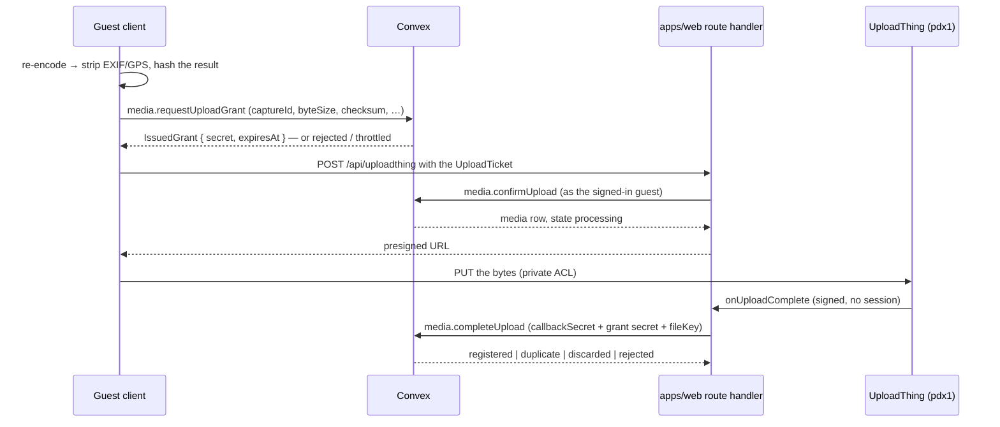

Four things about this shape are load-bearing:

1. **The guest never holds a provider credential.** They hold a grant. `apps/web`'s route handler is
   the only thing in the system with an `UPLOADTHING_TOKEN`, and the Expo app uploads _through it_
   rather than around it.
2. **Metadata is stripped at capture, by re-encoding**, before the checksum is taken — so the value
   the grant is minted against is the value of the stripped file. Server-side stripping would mean
   writing the GPS-bearing original to storage first, which is the artefact the promise says never
   exists. The claim records what the pipeline actually did; it is never a literal `true`. See
   [ADR 0004](adr/0004-private-upload-pipeline.md) §7.

   Since Sprint 4 the claim is **two** booleans, because video broke the identity between them:

   | Field                     | Means                             | Consulted by                                |
   | ------------------------- | --------------------------------- | ------------------------------------------- |
   | `sourceMetadataStripped`  | these bytes were **re-encoded**   | the derivative grant, as a **precondition** |
   | `sourceCarriesNoLocation` | these bytes **carry no location** | the read path (`mayServeOriginal`)          |

   For a photograph they are the same fact — the re-encode is the mechanism. For a clip they are
   not: no client can transcode 60 seconds of 1080p in the time a guest will wait, so `apps/mobile`
   sends `false` / `true` (structural: the app ships no location permission on either platform, and
   video library import is not built) and `apps/web` sends `false` / `false` (an `input[capture]`
   element is a request, not a guarantee — the same sheet offers the camera roll). Absent means
   "same as the re-encode claim", so every row written before the split keeps exactly the meaning
   and exactly the visibility it had. `metadataClaimOf` in
   [`contracts/media.ts`](../packages/contracts/src/media.ts) is the only place that default lives.

3. **Completion needs two credentials.** The grant says _which_ upload; `UPLOAD_CALLBACK_SECRET` says
   the caller is our own route handler. Without the second, a guest replaying their own legitimate
   grant could point a media row at any file key in the app.
4. **All four completion outcomes are HTTP 200.** A callback that answers with an error is one the
   provider retries for ever, and "we already had this" and "the guest withdrew it mid-flight" are
   not conditions retrying will fix. Anything Convex refuses to attach, it schedules for deletion.
5. **The sequence above runs once per file role**, not once per capture. A photo does it twice
   (original, preview) and a video three times (original, poster, preview), against the same
   `captureId`. Only the `original` pass creates the media row and settles its state; the others
   attach a key and stop. See the Derivatives section below.

### The upload ticket

`uploadTicketSchema` in [`packages/contracts/src/upload.ts`](../packages/contracts/src/upload.ts) is
the wire between _whichever_ client is uploading and the route handler. It lives in contracts, not in
either app, because `apps/mobile` deliberately does not depend on the website's build — when the
shape lived in `apps/web` the two sides drifted (the app sent only the grant secret) with nothing to
catch it.

It is **not a credential**. `ticket.secret` is; everything else is a claim about the file, which the
middleware cross-checks against the file actually offered (`checkTicketAgainstFiles`) before it
spends a round trip. The check that _binds_ is `matchesGrant` in Convex, where one side of the
comparison is a value the server minted. `buildUploadTicket` takes `eventId`, `captureId`,
`mediaType` and `byteSize` from the grant rather than from client state, so a ticket cannot describe
a file other than the one that was authorised.

### Derivatives

Both clients produce the derivatives on the device and upload them alongside the original, under the
**same `captureId`** with a different **file role**. The full reasoning — and why there is no
server-side step — is [ADR 0008](adr/0008-client-produced-derivatives.md).

| Role       | Photo                          | Video             | Who is served it                         |
| ---------- | ------------------------------ | ----------------- | ---------------------------------------- |
| `original` | 2560 px web / 4096 px app JPEG | the recorded file | submitter, hosts, and guests if stripped |
| `preview`  | 480 px web / 640 px app JPEG   | short muted clip  | everyone who may see the row             |
| `poster`   | —                              | still frame, JPEG | everyone who may see the row             |

The original's ceilings differ per platform because mobile Safari caps canvas area and silently
returns a blank bitmap past it, which `expo-image-manipulator` does not do. Both profiles live
together in [`packages/contracts/src/capture.ts`](../packages/contracts/src/capture.ts). Output is
always JPEG for images: the re-encode is happening anyway for the metadata strip, and it normalises
iPhone HEIC into something the organiser's laptop can display.

What the backend enforces:

1. **A derivative gets its own grant** — a grant binds one exact body by size and checksum, so it
   cannot cover three files. Same capture, different `fileRole`.
2. **Its own caps.** A preview or poster is held to **2 MiB**, a video preview clip to 25 MiB, where
   the originals get 20 MB and 250 MB. A camera JPEG with its EXIF block intact does not fit in 2 MiB.
3. **The re-encode claim is required**, not merely recorded (`derivativeMetadataNotStripped`). The
   original's `sourceMetadataStripped` is read on the read path (ADR 0004 §7); a derivative's is a
   precondition of the grant, because the derivative is what third parties are served.
4. **A derivative attaches and nothing else.** It does not settle the row, move `events.counts`, or
   count as a submission — one capture is one submission however many objects it is made of. The
   audit action is `media.derivative_attached`, not `media.upload_completed`.
5. **Ordering is free, and a missing derivative never strands a capture.** A preview whose original
   has not landed is deleted rather than orphaned; the client retries. A capture with no preview is
   still `pending` and still moderatable — what it loses is visibility to fellow guests.
6. **Withdrawal takes all three objects** (`storageKeysOf`).

`mayServeOriginal` in [`lib/media.ts`](../packages/backend/convex/lib/media.ts) is where this lands
on the read path. Its "serve nothing" branch is now "serve the derivative instead" — and it keeps the
old branch for the case where no derivative has arrived yet:

| Viewer                    | Original carries no location | Gets                        |
| ------------------------- | ---------------------------- | --------------------------- |
| submitter, owner, cohost  | either                       | original + preview + poster |
| another guest             | yes                          | original + preview + poster |
| another guest             | no / unknown                 | preview + poster only       |
| another guest, no preview | no / unknown                 | nothing                     |

The question in that column is deliberately **location, not encoding**: the invariant in PLAN.md is
about location, and reading the re-encode flag here would withhold a mobile clip from every fellow
guest on the strength of a flag that answers a different question. The derivative grant asks the
other half, and that asymmetry is the point — on the original the claim is recorded and read here;
on a derivative it is a precondition of the grant existing at all.

### Moderation

Three actions — `approve`, `decline`, `revoke` — through one mutation, `moderation.moderate`, which
always takes a list. `revoke` lands in `declined` like a decline but **refuses anything not currently
`approved`**, so "un-approve this" cannot become "decline this thing nobody approved" when two hosts
work the same grid. There is no `approved → pending`: the state machine has no such edge, and the
pending badge must not count items nobody is waiting on.

Every decision writes, in one transaction: the state (through the machine), the event counters, a
`moderationDecisions` row carrying the **prior** state and the actor, the `moderatedAt` stamps, and an
audit row. Bulk is the same function per item, sequentially — they all patch the same `counts` object.

A batch **succeeds partially**: refusals come back itemised (`stillProcessing`, `withdrawn`,
`notApproved`) and the mutation throws only for failures of the request. Repeating an action returns
`changed: false` and writes nothing.

"Removed from the gallery immediately" is the state moving — the gallery and the slideshow are
reactive queries over `approved`. A signed URL already handed out still outlives the decision by up to
ten minutes; only deleting the object invalidates it (ADR 0004).

### Reports and blocks

Both exist because App Review requires them, and both are deliberately weaker than they could be.
See [ADR 0005](adr/0005-moderation-model.md).

- **A report flags; it does not moderate.** Any member may report somebody else's item; it raises
  `media.flaggedAt`, sorts the item to the top of the host's queue and changes nothing else.
  Auto-hiding would hand any guest a veto over any other guest's photograph. Idempotent per
  `(media, reporter)`. The count is shown to hosts only; the reporter's identity to nobody.
- **A block is a filter on the blocker's own reads.** Per-account and global. It hides the blocked
  account's media from the blocker's gallery and slideshow, notifies nobody, changes nothing for
  anybody else, and does not touch a membership. In a host's pending queue it sorts last rather than
  hiding, so blocking cannot be used to stall a queue; it never hides your own media from you.

### The App Review demo login

Apple has to be able to sign in without a mailbox. `generateOTP` in
[`convex/otp.ts`](../packages/backend/convex/lib/otp.ts) returns a **fixed** code for exactly one
address, gated on two environment variables being set together — `DEMO_LOGIN_EMAIL` and
`DEMO_LOGIN_OTP`.

What makes this a narrow hole rather than a back door:

- **The code still goes through Better Auth.** Nothing compares a submitted code to an environment
  variable. The fixed value is _issued_ as that account's challenge and then verified against the
  stored hash like any other, with the same ten-minute expiry and five-attempt limit.
- **Unset means the branch does not exist.** With either variable missing the function returns
  `undefined` and the normal random path runs. There is no code path from an environment variable to
  an accepted login.
- **One address, and only that address.** It skips the send throttle and the email — there is no
  mailbox to send to — and changes nothing for anybody else.
- **Every use is audited** as `auth.demo_sign_in`.

There is deliberately **no `DEPLOYMENT_ENVIRONMENT !== production` gate**, contrary to an earlier
Sprint 3 note: Apple reviews the _production_ build against the production deployment, so such a gate
would disable the thing at exactly the moment it is needed. The gate is the two variables, the one
address, and the audit trail — and the operational half of it is **unsetting both once the build is
approved**, which is why that instruction is in `.env.example` next to the variables.

`demo.seedDemoEvent` (internal, refuses unless both variables are set, idempotent) builds the party
the reviewer lands in; `bun run seed:demo <assetKey…>` drives it. The asset keys are supplied by hand
because a Convex mutation cannot put bytes into storage — without them the demo party has rows and no
thumbnails.

## The storage adapter

Nothing in `convex/` talks to UploadThing directly. Every read and every delete goes through a
`StorageAdapter`, resolved per call:

```
resolveStorageAdapter(region) →
  test override        → the in-memory fake (packages/backend/convex/lib/storage/fake.ts)
  no UPLOADTHING_TOKEN → unconfiguredAdapter: reads omit the URL, deletes throw
  otherwise            → createUploadThingAdapter(region)
```

**The region always comes from the row, never from the environment**: `media.storageRegion` for a
read or a delete, `events.storageRegion` for a grant. `STORAGE_DEFAULT_REGION` only ever seeds a new
event. That is what makes "files never migrate" true rather than aspirational — a future region
change cannot retroactively send a delete to the wrong app.

The unconfigured adapter is why the whole repo tests offline. Reads catch
`StorageNotConfiguredError` and omit the URL, so a guest with no credentials configured still sees
that their photo is pending. Deletes deliberately let it escape: silently not deleting a withdrawn
photo is the worst outcome this product has.

## `storageRegion`

`events.storageRegion` is a string enum, currently `["pdx1"]`. It is set at event creation and
becomes **immutable once the first upload lands**. Upload grants carry it, media rows record it, and
a storage adapter resolves credentials and host from it. Files never migrate when the value changes.

The full reasoning, alternatives and the multi-region path are in
[ADR 0002](adr/0002-storage-region-adapter.md).

## Upload grants

An `uploadGrants` row is short-lived, single-use permission to put **one exact file** into storage.
A guest holds no provider credential; they hold one of these.

| Bound to        | Why                                                                                |
| --------------- | ---------------------------------------------------------------------------------- |
| `eventId`       | A grant for one party cannot store a file against another.                         |
| `captureId`     | Client-generated, stable across retries. What makes the whole pipeline idempotent. |
| `mediaType`     | Decides which cap in `MEDIA_LIMITS` applies.                                       |
| `byteSize`      | Checked again at completion — a body that grew has walked around the cap.          |
| `checksum`      | Lower-case hex SHA-256. Checked at completion when the client supplies one.        |
| `storageRegion` | Copied from the event, never from the environment. Files never migrate (ADR 0002). |

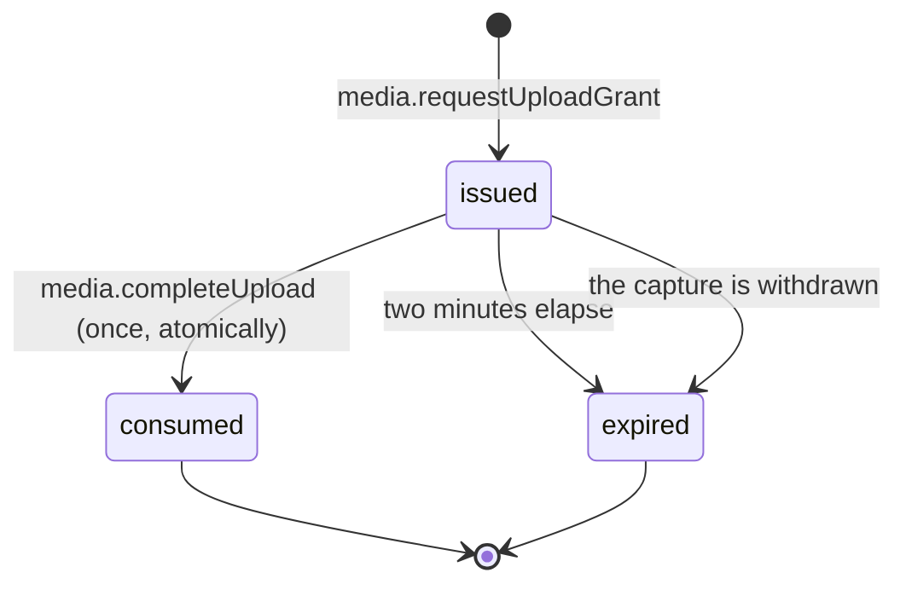

- **Two-minute TTL** (`GRANT_POLICY.ttlMs`), measured to the point the upload _starts_, not to the
  point it finishes — a 250 MB video on party wifi takes longer than that and is fine.
- **The secret is stored hashed**, like the OTP codes in `userEmails`. It is returned once and never
  logged or audited.
- **Single use is the transaction, not the status column.** The read, the decision and the write all
  happen inside one Convex mutation, which is serialisable — two racing completions cannot both
  observe `issued`.
- **Expiry is a fact about the clock.** A row still marked `issued` past its `expiresAt` is unusable
  whether or not anything has swept it; the status is tidying.

`uploadAttempts` is the per-account grant counter. It is a separate table from `joinAttempts` because
it throttles _successes_ — an issued grant is the scarce thing — so a guest fumbling a six-digit code
can never eat into the budget they need to send the photo they came here to send.

## Not yet written

Filled in by the sprint that builds the thing, rather than guessed now:

- **(Sprint 6)** The audit-event taxonomy as a table — the closed list lives in
  `AUDIT_ACTIONS` and every value is documented there; a rendered index is still owed.
- **(Sprint 6)** A screen-by-screen tour of `/admin` as the UI lays it out. What each operation
  _means_ is above under "Admin operations"; what is still owed is the walkthrough of the four
  routes, which is worth writing once the dress rehearsal has said whether they are the right four.
