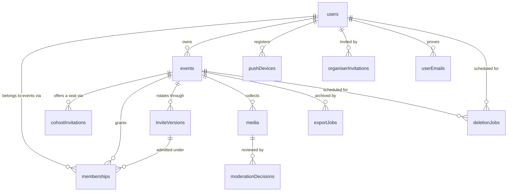
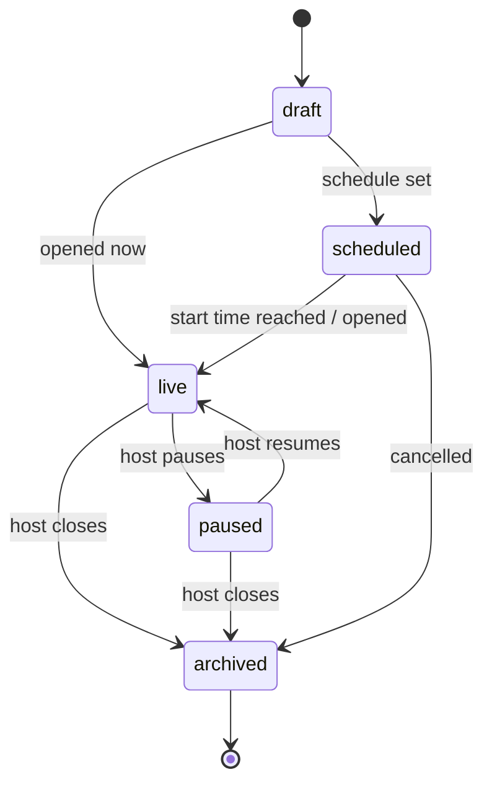
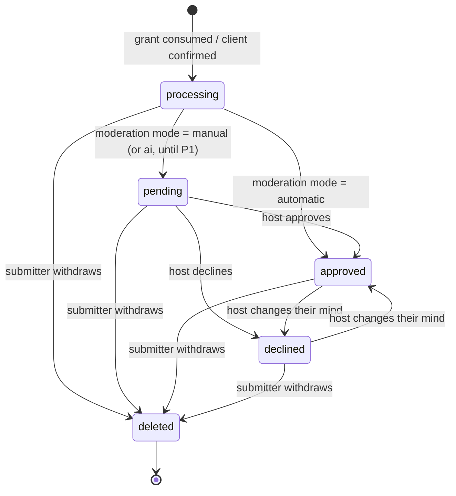
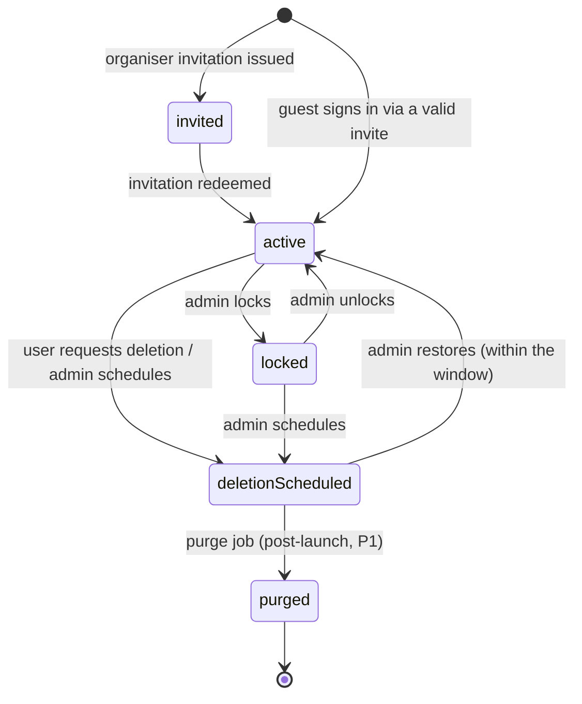
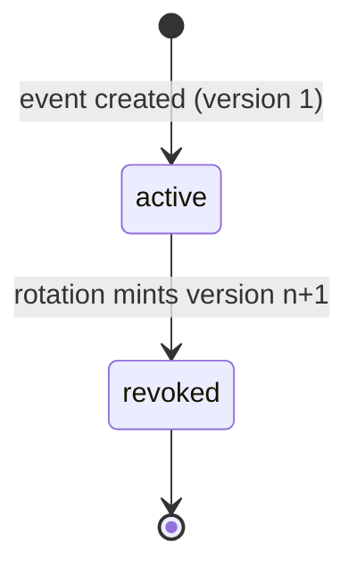
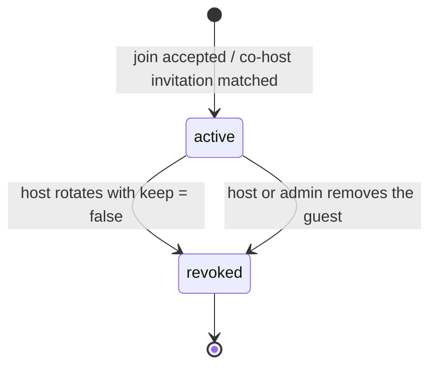
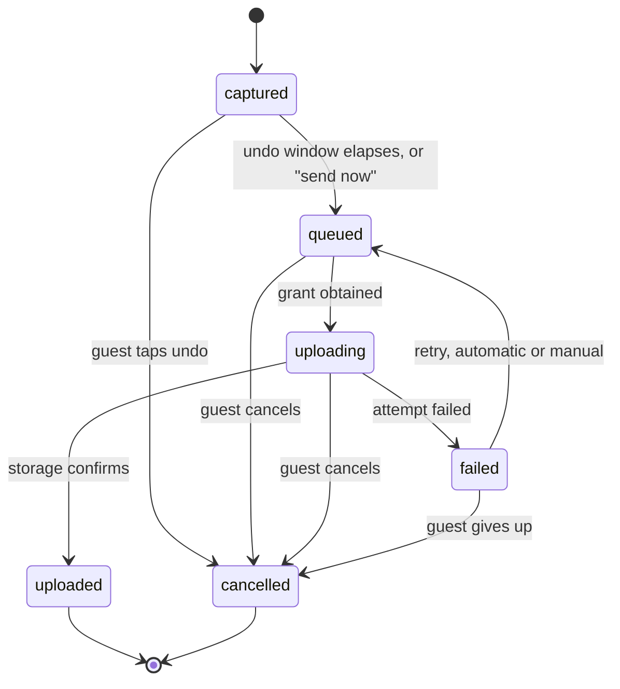
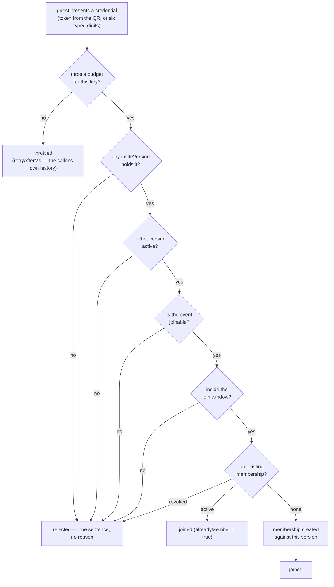
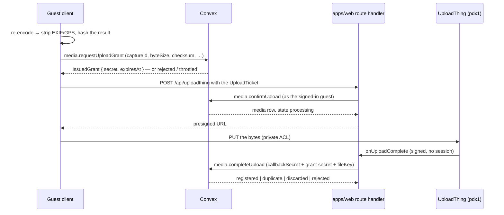
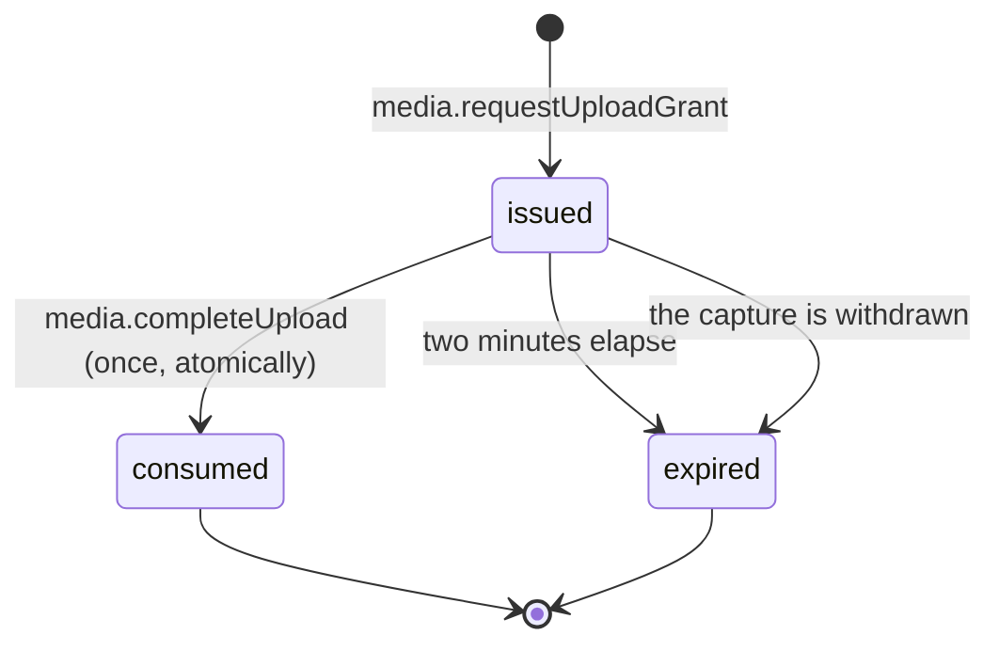

# Domain model

> Seeded from [`PLAN.md`](../PLAN.md) on 28 Jul 2026.
>
> **This document is indicative, not authoritative.** `packages/backend/convex/schema.ts` defines the
> real tables and `packages/contracts` defines the real validators and permission rules. Field lists
> here name the concepts and their relationships; they are not a column-by-column contract. When the
> two disagree, the code is right and this file is a bug — fix it in the same PR.

## Entities at a glance



`auditEvents` is deliberately absent from the diagram: it references everything and is written by
every privileged action.

| Entity                 | Holds                                                                                        | Notes                                                       |
| ---------------------- | -------------------------------------------------------------------------------------------- | ----------------------------------------------------------- |
| `users`                | identity, verified email, display name, avatar, `onboardedAt`, account state                 | one row per human, shared across app and web                |
| `organiserInvitations` | email, token, issuing admin, expiry, redemption                                              | the only way into the private beta                          |
| `cohostInvitations`    | event, email, inviting host, expiry, redemption                                              | a co-host seat offered to an address with no account yet    |
| `userEmails`           | user, address, status, hashed verification code, attempts                                    | a second address proven by OTP (Apple private relay)        |
| `joinAttempts`         | throttle key, failure count, window, lockout                                                 | holds no code and no event id — counters only               |
| `events`               | name, schedule + timezone, cover, accent, moderation mode, state, **`storageRegion`**        | see [ADR 0002](adr/0002-storage-region-adapter.md)          |
| `memberships`          | user ↔ event, role, admitting `inviteVersion`, state                                         | a guest's presence in one event                             |
| `inviteVersions`       | six-digit code, high-entropy QR token, version number, active flag                           | rotation creates a new version, never mutates the old       |
| `media`                | event, submitter, capture id, type, byte size, checksum, `storageRegion`, storage key, state | one row per submitted capture                               |
| `moderationDecisions`  | media, decider, decision, reason, timestamp                                                  | append-only; the media row carries the current state        |
| `exportJobs`           | event, requester, state, artefact key, expiry                                                | **post-launch (P2)** — table shape reserved                 |
| `pushDevices`          | user, Expo push token, platform, last seen                                                   | one row per installed app instance                          |
| `deletionJobs`         | subject (user or event), scheduled-at, state, requester                                      | states ship at launch, the purge worker is post-launch (P1) |
| `auditEvents`          | actor, action, subject, reason, before/after summary, timestamp                              | immutable; every admin and host action writes one           |

## Roles and permissions

Four roles: `globalAdmin`, and the three event roles `owner`, `cohost`, `guest`. `globalAdmin` is a
platform-level property of a user; the others are properties of a **membership**, so the same person
can be an owner of one event and a guest in another.

Legend: ✅ allowed · ❌ denied · — not applicable.

| Capability                          | `guest` | `cohost` | `owner` | `globalAdmin` |
| ----------------------------------- | :-----: | :------: | :-----: | :-----------: |
| Join with a valid, current invite   |   ✅    |    ✅    |   ✅    |       —       |
| Capture and upload to the event     |   ✅    |    ✅    |   ✅    |      ❌       |
| See own media and its status        |   ✅    |    ✅    |   ✅    |      ❌       |
| Withdraw own media                  |   ✅    |    ✅    |   ✅    |      ❌       |
| View the approved gallery           |   ✅    |    ✅    |   ✅    |      ❌       |
| Approve / decline any media         |   ❌    |    ✅    |   ✅    |      ❌       |
| Run the slideshow                   |   ❌    |    ✅    |   ✅    |      ❌       |
| Rotate the invite (code + QR token) |   ❌    |    ✅    |   ✅    |      ✅       |
| Revoke a membership                 |   ❌    |    ✅    |   ✅    |      ✅       |
| Invite a co-host                    |   ❌    |    ❌    |   ✅    |      ❌       |
| Edit event settings                 |   ❌    | partial  |   ✅    |      ❌       |
| Delete or transfer the event        |   ❌    |    ❌    |   ✅    |   schedule    |
| Invite an organiser into the beta   |   ❌    |    ❌    |   ❌    |      ✅       |
| Lock / unlock an account            |   ❌    |    ❌    |   ❌    |      ✅       |
| Schedule / restore deletion         |   ❌    |    ❌    |   own   |      ✅       |
| Read any media bytes                |   ❌    |    ❌    |   ❌    |    **❌**     |
| Impersonate a user                  |   ❌    |    ❌    |   ❌    |    **❌**     |

Two invariants worth stating loudly, because they are easy to erode:

1. **A co-host is never an owner.** No delete, no transfer, no change of ownership. Ever.
2. **A global admin never sees media and never impersonates.** Admin power is over accounts, events
   and codes — not over content.

Everything above is expressed as testable functions in
[`packages/contracts/src/permissions.ts`](../packages/contracts/src/permissions.ts), not as scattered
`if` statements in UI code:

- `hasCapability(role, action)` — does this role ever get this action?
- `can(role, action, resource)` — …and does the resource's state and ownership allow it now?
- `canAct(actor, action, resource)` / `explainCan(…)` — …and is the actor's **account** active enough?

`permissions.test.ts` holds a `Record<Action, readonly Role[]>` covering every action × role pair, so
adding an action is a compile error until the table is updated. The backend never re-derives a rule:
`requirePermission` in `packages/backend/convex/lib/guards.ts` only turns a `false` into the right
`ConvexError`.

## State machines

### Event



Uploads are accepted in `live` only. **Joins are accepted in `scheduled`, `live` and `paused`** — a
QR printed a week early has to work when the guest scans it in the hallway, and pausing is a pressure
valve on uploads, not a locked front door (`JOINABLE_EVENT_STATES` in
[`contracts/src/events.ts`](../packages/contracts/src/events.ts)). `paused` keeps the gallery and
slideshow readable but refuses new captures. `archived` is read-only.

Hosts may set every state except `deletionScheduled` (`HOST_SETTABLE_EVENT_STATES`). That one is
reserved for the deletion flow, because reaching it must also write the `deletionJobs` row that makes
the 30-day restore window real.

### Media



The terminal state is `deleted`, not `withdrawn` — one state covers a guest taking their photo back
and a host removing it, because from every read path's point of view the two are the same fact and a
second name for it is a second thing to remember to filter on. `media.withdrawnAt` records _which_
of the two it was. There is no `failed` state either: an upload that never completes leaves a
`processing` row with no storage key, which is the same shape a retry can pick up, and the grant that
would have completed it simply expires.

Who sees what is [`canSeeMedia`](../packages/contracts/src/media.ts), and it is the read-path half of
the privacy invariant in `PLAN.md`:

| Role          | Others' media             | Own media                 |
| ------------- | ------------------------- | ------------------------- |
| `guest`       | `approved` only           | every state but `deleted` |
| `cohost`      | every state but `deleted` | every state but `deleted` |
| `owner`       | every state but `deleted` | every state but `deleted` |
| `globalAdmin` | **nothing**               | **nothing**               |

Because the two completion signals can arrive in either order and more than once, the transition
into `processing` and out of it is **idempotent and reconciling**, keyed on `(eventId, captureId)`:
a late callback for an already-settled item is a no-op, and one for a withdrawn item deletes its own
bytes rather than reviving the row. [ADR 0004](adr/0004-private-upload-pipeline.md) has the full
argument; `packages/backend/convex/media.test.ts` has the tests.

### Account



`deletionScheduled` **revokes access immediately** — it is not a soft warning state. Apple requires
in-app account deletion, and this is what that button does at launch. The 30-day hard purge lands
post-launch; until then the final step is operated by script.

`locked` suspends owner and co-host access, joins, uploads and slideshows across every event the
account owns. That blast radius is the point: it is the party-night emergency stop.

### Invite version



Two rules make this smaller than it looks:

- **A version is never mutated.** Rotation inserts a new row and marks the old one `revoked`; the
  old code and token stay on the old row. That is what lets "how did this person get in last week?"
  stay answerable after three rotations.
- **Exactly one version is `active` per event.** Everything a guest can present resolves to a
  version, and only the active one admits.

Rotation carries a `keepExistingMemberships` choice. `true` keeps everyone and only kills the old
credential; `false` additionally revokes **guest** memberships — hosts always keep theirs, because
locking a co-host out mid-party helps nobody. Memberships record the version that admitted them, so
a revoked-version join is refusable without a second table.

### Membership



`revoked` is terminal, and that is the transition worth stating plainly _because_ it is missing: a
revoked membership is **not** re-activated by presenting a current code. A host who removed someone meant it, and a fresh QR must
not undo that. The join returns the same single rejection sentence as every other refusal, so the
person cannot tell "removed" from "wrong code".

### Capture, client side



This machine lives on the device, not in Convex — `CAPTURE_STATES` and `captureStateMachine` in
[`packages/contracts/src/media.ts`](../packages/contracts/src/media.ts). The terminal state is
**`cancelled`**, not `discarded`, and a failed attempt goes back through `queued` rather than
straight to `uploading`: `TERMINAL_CAPTURE_STATES` is derived from the transition table itself, so
both clients agree by construction rather than by two lists staying in step.

`uploaded` is where the server-side **Media** machine picks up. Both clients drive the same
vocabulary — `apps/web`'s `uploadReducer` and `apps/mobile`'s `queueReducer` — but only the app's
queue is **durable**: it persists to the document directory, rewrites anything left `uploading` back
to `queued` on cold start and on foreground, and retries on a backoff ladder. Mobile web keeps its
queue in memory and offers a retry button, because a browser tab that is closed has no queue to
resume. Background retry (uploading while the app is off screen) is best-effort and post-launch.

## Invitations and joining

An event has exactly one **active invite version** at a time. Each version carries a **six-digit
join code**, unique among joinable events, and a **high-entropy QR token** (160 bits, Crockford
base32) used in the universal link. Rotation mints a new version and deactivates the old one; the
host chooses whether existing memberships are **kept or revoked** — hosts always keep theirs. A join
attempt against a superseded version is rejected.

"Unique among joinable events" is doing real work. Archiving an event frees its code **implicitly**:
nothing is rewritten, the old row keeps the code, and the code stops counting because its event is no
longer joinable. So a lookup by code can match several rows and must filter rather than assume one —
and re-opening an archived event has to re-check its code, **minting a new invite version** if
somebody else has since been given that number. Not editing the old row: an `inviteVersions` row is
the historical credential every membership admitted under it points at, so rewriting its code would
make the log claim guests joined with digits that did not exist yet.

The same immutability rule is why a rotation must always _change_ the code. The collision check
excuses the event's own outgoing version — otherwise no rotation could run — and that exemption used
to let a random draw, or an admin picking a specific value, hand back the six digits the rotation was
supposed to kill.



Every path into `rejected` returns the **same value**: one fixed message and no other field. The
five reasons are named in `JOIN_REJECTION_REASONS` and go to `auditEvents` only. `throttled` is the
one failure that is safe to be specific about, because it depends solely on the caller's own attempt
history, which is not information they lack.

Joining is authenticated, rate-limited, enumeration-protected and audited:

- **Authenticated** — there is always a user, which is what gives the throttle a key.
- **Rate-limited** — `joinAttempts` counts failures per key (`user:<id>`, plus `net:<hash>` for calls
  that came through `apps/web`'s `POST /api/join`, which derives it from the forwarded address).
  Ten failures in fifteen minutes starts a fifteen-minute lockout, and **only elapsed time hands the
  budget back**. A success used to reset it, which was a complete bypass: an admitted attempt is not
  scarce — replaying your own party's code counts — so "nine guesses, one replay" looped forever.
  The read-decide-write happens inside a Convex mutation, so it is transactional.
  The Expo app has no server in front of it and is charged on the account key alone; a client-supplied
  network key is treated as untrusted, because it can only ever add a key, never remove one.
- **Enumeration-protected** — a six-digit code is only a million values, so every failure returns the
  same value: one fixed sentence, no other fields. "No such code", "superseded version", "not
  joinable yet", "outside the schedule window" and "your membership was revoked" are
  indistinguishable from outside. The real reason goes to `auditEvents` and nowhere else.
- **Audited** — every attempt writes a row: `membership.join_succeeded` for every admitted one
  (including repeat scans that change nothing — a replayed credential must not be invisible),
  `membership.created` only when a row actually appears, and `membership.join_rejected` for every
  refusal, throttles included.

The pre-join preview follows the same logic, which is why it is split in two: previewing from a
**token** is a query (160 bits is not enumerable, and the join page must render before sign-in),
while previewing from a typed **code** is a _mutation_, because only a mutation can spend a throttle
budget. Both run the same credential evaluation as a join, and the code preview is audited on the
same terms — it is the endpoint a code-walker actually calls, so a silent refusal there would blind
the log exactly at the ceiling.

### Verified-email matching

On authentication — and on demand via `users.refreshRoles` — every address the user has **proven**
is matched against pending `organiserInvitations` and `cohostInvitations`. A match accepts the
invitation and grants the role: organiser (unlocking event creation) or a `cohost` membership.

Only verified addresses count. An address is verified when the provider vouched for it
(`users.emailVerified`) or its owner proved it with a six-digit code (`userEmails`). Anything looser
would mean typing someone else's address into a sign-up form inherits their co-host seat.

Apple private-relay users are the reason `userEmails` exists: an invitation cannot reach
`@privaterelay.appleid.com`, so they add a real address and prove it through the same OTP
infrastructure — same ten-minute expiry, same five-guess budget, same per-address send ceiling, code
stored hashed.

### Profile and onboarding

`users.displayName` is what a host reads in the moderation queue, so it has exactly **one** writer:
the `users.updateProfile` mutation, called by the name-confirmation step on both web and app.

It used to have two. Both clients wrote the name through Better Auth's `updateUser` and relied on
the `user.onUpdate` trigger to mirror it into `users.displayName` — which works right up until
anything else touches the Better Auth row. Verifying an email fires that trigger, and the guest who
typed "Sam" would quietly become "Samantha Smith" again. The trigger now defers to a confirmed name:
**a provider name is a default, and a default never overwrites a choice.**

`users.onboardedAt` is what makes that rule expressible, and it is a column rather than a device flag
for the same reason. `displayName` cannot answer "has this human ever told us what to call them?",
because it falls back to the local part of the email address and so is never empty. With the column,
a reinstall does not re-prompt and a guest who onboarded on their phone is not asked again on the
web.

## The media pipeline

One capture, end to end. Every step is the same on both clients; only the encoder and the file
system differ.



Four things about this shape are load-bearing:

1. **The guest never holds a provider credential.** They hold a grant. `apps/web`'s route handler is
   the only thing in the system with an `UPLOADTHING_TOKEN`, and the Expo app uploads _through it_
   rather than around it.
2. **Metadata is stripped at capture, by re-encoding**, before the checksum is taken — so the value
   the grant is minted against is the value of the stripped file. Server-side stripping would mean
   writing the GPS-bearing original to storage first, which is the artefact the promise says never
   exists. `sourceMetadataStripped` records what the pipeline actually did; it is never a literal
   `true`. See [ADR 0004](adr/0004-private-upload-pipeline.md) §7.
3. **Completion needs two credentials.** The grant says _which_ upload; `UPLOAD_CALLBACK_SECRET` says
   the caller is our own route handler. Without the second, a guest replaying their own legitimate
   grant could point a media row at any file key in the app.
4. **All four completion outcomes are HTTP 200.** A callback that answers with an error is one the
   provider retries for ever, and "we already had this" and "the guest withdrew it mid-flight" are
   not conditions retrying will fix. Anything Convex refuses to attach, it schedules for deletion.

### The upload ticket

`uploadTicketSchema` in [`packages/contracts/src/upload.ts`](../packages/contracts/src/upload.ts) is
the wire between _whichever_ client is uploading and the route handler. It lives in contracts, not in
either app, because `apps/mobile` deliberately does not depend on the website's build — when the
shape lived in `apps/web` the two sides drifted (the app sent only the grant secret) with nothing to
catch it.

It is **not a credential**. `ticket.secret` is; everything else is a claim about the file, which the
middleware cross-checks against the file actually offered (`checkTicketAgainstFiles`) before it
spends a round trip. The check that _binds_ is `matchesGrant` in Convex, where one side of the
comparison is a value the server minted. `buildUploadTicket` takes `eventId`, `captureId`,
`mediaType` and `byteSize` from the grant rather than from client state, so a ticket cannot describe
a file other than the one that was authorised.

### Derivatives

Both clients produce two files and upload one:

| File     | Web (`<canvas>`) | App (`expo-image-manipulator`) | Goes where                        |
| -------- | ---------------- | ------------------------------ | --------------------------------- |
| original | 2560 px, q 0.85  | 4096 px, q 0.92                | uploaded — this is the submission |
| preview  | 480 px, q 0.6    | 640 px, q 0.6                  | stays on the device               |

The ceilings differ because mobile Safari caps canvas area and silently returns a blank bitmap past
it, which `expo-image-manipulator` does not do. Both profiles live together in
[`packages/contracts/src/capture.ts`](../packages/contracts/src/capture.ts) so the difference is a
recorded decision rather than an accident. Output is always JPEG: the re-encode is happening anyway
for the metadata strip, and it normalises iPhone HEIC into something the organiser's laptop can
display.

The preview is **local-only** on both platforms — `media.completeUpload` takes one `fileKey` per
capture, so there is nowhere to put a second object. Sprint 4's video poster needs that path.

## The storage adapter

Nothing in `convex/` talks to UploadThing directly. Every read and every delete goes through a
`StorageAdapter`, resolved per call:

```
resolveStorageAdapter(region) →
  test override        → the in-memory fake (packages/backend/convex/lib/storage/fake.ts)
  no UPLOADTHING_TOKEN → unconfiguredAdapter: reads omit the URL, deletes throw
  otherwise            → createUploadThingAdapter(region)
```

**The region always comes from the row, never from the environment**: `media.storageRegion` for a
read or a delete, `events.storageRegion` for a grant. `STORAGE_DEFAULT_REGION` only ever seeds a new
event. That is what makes "files never migrate" true rather than aspirational — a future region
change cannot retroactively send a delete to the wrong app.

The unconfigured adapter is why the whole repo tests offline. Reads catch
`StorageNotConfiguredError` and omit the URL, so a guest with no credentials configured still sees
that their photo is pending. Deletes deliberately let it escape: silently not deleting a withdrawn
photo is the worst outcome this product has.

## `storageRegion`

`events.storageRegion` is a string enum, currently `["pdx1"]`. It is set at event creation and
becomes **immutable once the first upload lands**. Upload grants carry it, media rows record it, and
a storage adapter resolves credentials and host from it. Files never migrate when the value changes.

The full reasoning, alternatives and the multi-region path are in
[ADR 0002](adr/0002-storage-region-adapter.md).

## Upload grants

An `uploadGrants` row is short-lived, single-use permission to put **one exact file** into storage.
A guest holds no provider credential; they hold one of these.

| Bound to        | Why                                                                                |
| --------------- | ---------------------------------------------------------------------------------- |
| `eventId`       | A grant for one party cannot store a file against another.                         |
| `captureId`     | Client-generated, stable across retries. What makes the whole pipeline idempotent. |
| `mediaType`     | Decides which cap in `MEDIA_LIMITS` applies.                                       |
| `byteSize`      | Checked again at completion — a body that grew has walked around the cap.          |
| `checksum`      | Lower-case hex SHA-256. Checked at completion when the client supplies one.        |
| `storageRegion` | Copied from the event, never from the environment. Files never migrate (ADR 0002). |



- **Two-minute TTL** (`GRANT_POLICY.ttlMs`), measured to the point the upload _starts_, not to the
  point it finishes — a 250 MB video on party wifi takes longer than that and is fine.
- **The secret is stored hashed**, like the OTP codes in `userEmails`. It is returned once and never
  logged or audited.
- **Single use is the transaction, not the status column.** The read, the decision and the write all
  happen inside one Convex mutation, which is serialisable — two racing completions cannot both
  observe `issued`.
- **Expiry is a fact about the clock.** A row still marked `issued` past its `expiresAt` is unusable
  whether or not anything has swept it; the status is tidying.

`uploadAttempts` is the per-account grant counter. It is a separate table from `joinAttempts` because
it throttles _successes_ — an issued grant is the scarce thing — so a guest fumbling a six-digit code
can never eat into the budget they need to send the photo they came here to send.

## Not yet written

Filled in by the sprint that builds the thing, rather than guessed now:

- **(Sprint 4)** Report and block entities required for App Review.
- **(Sprint 5)** The audit-event taxonomy — the closed list of `action` values.
